<picture><source media="(prefers-color-scheme: dark)" srcset="assets/dark/banner.svg"></picture>

<picture><source media="(prefers-color-scheme: dark)" srcset="https://readme-typing-svg.demolab.com?font=IBM+Plex+Mono&weight=500&size=15&duration=2200&pause=1200&color=FF6A2B&width=640&height=28&lines=ESPECIALIDAD%3A+APPS+M%C3%93VILES+CON+FLUTTER+Y+KOTLIN;ESPECIALIDAD%3A+BACKENDS+EN+PYTHON+Y+TYPESCRIPT;ESPECIALIDAD%3A+VISI%C3%93N+POR+COMPUTADOR+CON+YOLO;ESPECIALIDAD%3A+INFRAESTRUCTURA+EN+GOOGLE+CLOUD;ESPECIALIDAD%3A+HERRAMIENTAS+PARA+AGENTES+DE+IA"></picture>

<a href="https://www.linkedin.com/in/jorge-solano-606276209"><picture><source media="(prefers-color-scheme: dark)" srcset="assets/dark/btn-linkedin.svg"></picture></a> <a href="mailto:jorgej-solanor@unilibre.edu.co"><picture><source media="(prefers-color-scheme: dark)" srcset="assets/dark/btn-correo.svg"></picture></a>

<picture><source media="(prefers-color-scheme: dark)" srcset="assets/dark/h-resumen.svg"></picture>

Estudio Ingeniería de Sistemas en la Universidad Libre de Barranquilla y desde noviembre de 2025 trabajo como desarrollador en GLocation. Por fuera del trabajo hago apps móviles en Flutter y Kotlin, backends en Python y TypeScript sobre Google Cloud, y visión por computador en el Semillero TI de la universidad.

También armo herramientas para trabajar con agentes de código: plugins y skills para Claude Code y Antigravity, y servidores MCP.

<picture><source media="(prefers-color-scheme: dark)" srcset="assets/dark/h-proyectos.svg"></picture>

<a href="https://github.com/JUNIORRDSR/VerifiClean"><picture><source media="(prefers-color-scheme: dark)" srcset="assets/dark/card-verificlean.svg"></picture></a> <a href="https://github.com/JUNIORRDSR/deteccion-enfermedades-mango-cascada"><picture><source media="(prefers-color-scheme: dark)" srcset="assets/dark/card-mango.svg"></picture></a>
<a href="https://github.com/DevsJJA/CrediRuta"><picture><source media="(prefers-color-scheme: dark)" srcset="assets/dark/card-crediruta.svg"></picture></a> <a href="https://github.com/LeoBarraza0/HealthByte"><picture><source media="(prefers-color-scheme: dark)" srcset="assets/dark/card-healthbyte.svg"></picture></a>
<a href="https://github.com/JUNIORRDSR/Antigravity-CLI-Skill"><picture><source media="(prefers-color-scheme: dark)" srcset="assets/dark/card-antigravity-skill.svg"></picture></a> <a href="https://github.com/JUNIORRDSR/Antigravity-safe-swicht"><picture><source media="(prefers-color-scheme: dark)" srcset="assets/dark/card-agy-auto-switch.svg"></picture></a>

<b>VerifiClean:</b> por qué el servidor nunca rechaza una evidencia

 

Cada evidencia se verifica en el servidor: distancia a la sede, hash SHA-256 de la foto, Play Integrity, un nonce atado a la visita, detección de GPS simulado, el checklist contra el asignado y la hora puesta por el servidor. Una evidencia sospechosa se guarda igual, con sus motivos, y aparece en el panel del administrador. Si la API respondiera con un error, quien quiera hacer trampa podría cambiar un parámetro y reintentar hasta pasar. Por la misma razón el supervisor nunca ve el veredicto de sus propias evidencias.

<b>Enfermedades del mango:</b> qué hay detrás del 0,909 de exactitud

 

Es el código y la evidencia del artículo *Detección y clasificación automatizada de enfermedades fitopatológicas en mango: un enfoque de arquitectura en cascada*, que escribí con Villa Bastidas y Molina-Cárdenas. Un detector YOLO26n encuentra los frutos y un clasificador YOLO11n-cls diagnostica cada uno: antracnosis, cancro bacteriano, costras, podredumbre del extremo del tallo o sano.

Antes de entrenar auditamos la fuga de datos: imágenes repetidas o casi repetidas entre entrenamiento y prueba. Con eso el conjunto se volvió a partir por grupos de origen. Cada imagen quedó registrada con su SHA-256 en manifiestos congelados, el protocolo se fijó antes de abrir la partición de prueba y los intervalos de confianza salen de un bootstrap por grupos. El repositorio también deja escritos los límites: son evaluaciones internas sobre imágenes publicadas y el sistema no se validó en campo. El prototipo anterior, con demo por webcam, está en [Mango-vision](https://github.com/JUNIORRDSR/Mango-vision).

<b>Más proyectos</b> de 2024 y 2025

 

| Proyecto | Qué es | Stack |
|---|---|---|
| [CrediRuta-Design](https://github.com/JUNIORRDSR/CrediRuta-Design) | Contratos visuales y prototipo navegable de CrediRuta, 38 pantallas | HTML, CSS |
| [CLAUDEMAX](https://github.com/Curcolor/CLAUDEMAX) | Entorno completo para Claude Code; colaboro con [@Curcolor](https://github.com/Curcolor) | JavaScript, Bash |
| [INKLU AI](https://github.com/JUNIORRDSR/INKLU-AI) | Conecta personas con discapacidad con empresas inclusivas | Python, JavaScript |
| [Incapacidades](https://github.com/JUNIORRDSR/Incapacidades) | Gestión digital de incapacidades laborales y pensiones | Next.js, NestJS, PostgreSQL, MongoDB |
| [ProjectInsight](https://github.com/JUNIORRDSR/Prueba-Tecnica) | Panel de proyectos con API REST y resumen generado por IA | Node.js, Express, Prisma, PostgreSQL |
| [ProntoApp](https://github.com/Curcolor/ProntoApp-) | Pedidos en tiempo real para negocios, con bot de Telegram | Flutter, Python |
| [Salas de cine](https://github.com/JUNIORRDSR/SISTEMAS-SALAS-DE-CINE) | Control de taquillas, con [cliente](https://github.com/JUNIORRDSR/Proyecto-Cine-Cliente) y [backend](https://github.com/JUNIORRDSR/Proyecto-Cine-Backend) | JavaScript |
| [Traductor](https://github.com/JUNIORRDSR/proyecto-fullstack) | Traductor español-inglés con frontend y backend | JavaScript |
| [Walli Wallet](https://github.com/Curcolor/WALLI_WALLET) | Billetera digital: transferencias, depósitos, retiros y pagos | Python |
| [CommUnity](https://github.com/Curcolor/COMMUNITY) | Reúne recursos de ayuda gratuita en un solo lugar | Python |
| [Luxora Couture](https://github.com/JUNIORRDSR/ecommerce---Luxora-couture) | E-commerce del examen de TalentoTech Caribe | Python |
| [ImageToMatrix](https://github.com/JUNIORRDSR/ImageToMatrix) | Convierte imágenes en matrices para entrenar CNN | Python |

<picture><source media="(prefers-color-scheme: dark)" srcset="assets/dark/h-tecnologias.svg"></picture>

| Ítem | Categoría | Componentes | Cant. |
|:---:|---|---|:---:|
| 01 | Móvil | `Flutter` `Dart` `Kotlin` `Jetpack Compose` | 4 |
| 02 | Backend | `Python` `FastAPI` `TypeScript` `Node.js` `Express` `NestJS` `Django` `Flask` | 8 |
| 03 | Web | `Next.js` `React` `Vite` `Tailwind CSS` `Astro` | 5 |
| 04 | Datos | `PostgreSQL` `Prisma` `Firestore` `MongoDB` `Redis` `SQLite` | 6 |
| 05 | Nube | `Google Cloud` `Cloud Run` `Docker` `Terraform` `GitHub Actions` | 5 |
| 06 | IA y visión | `YOLO` `PyTorch` `OpenCV` `Gemini` `LangChain` `Kaggle` | 6 |
| 07 | Pruebas | `Playwright` `k6` `pytest` | 3 |
| 08 | Agentes | `Claude Code` `MCP` `Obsidian` | 3 |
| | | **Total de componentes** | **40** |

<picture><source media="(prefers-color-scheme: dark)" srcset="assets/dark/h-actividad.svg"></picture>

<picture><source media="(prefers-color-scheme: dark)" srcset="https://github-readme-stats.vercel.app/api?username=JUNIORRDSR&show_icons=true&count_private=true&include_all_commits=true&hide=contribs&locale=es&custom_title=Registro%20en%20GitHub&border_radius=0&bg_color=0D1117&border_color=30363D&title_color=E6EDF3&icon_color=FF6A2B&text_color=E6EDF3&ring_color=FF6A2B"></picture> <picture><source media="(prefers-color-scheme: dark)" srcset="https://streak-stats.demolab.com/?user=JUNIORRDSR&locale=es&border_radius=0&background=0D1117&border=30363D&stroke=30363D&ring=FF6A2B&fire=FF6A2B&currStreakNum=E6EDF3&sideNums=E6EDF3&currStreakLabel=FF8A50&sideLabels=8B949E&dates=8B949E"></picture>

<picture><source media="(prefers-color-scheme: dark)" srcset="https://raw.githubusercontent.com/JUNIORRDSR/JUNIORRDSR/output/snake-dark.svg"></picture>

<b>Formación y certificaciones</b>

 

| Área | Título o certificación | Entidad |
|---|---|---|
| Formación | Ingeniería de Sistemas, desde 2021 | Universidad Libre |
| Formación | Técnico en Sistemas | SENA |
| Formación | Programación | TalentoTech Caribe |
| Nube | Google Cloud Foundations | Google Cloud |
| Nube | Skill badges: Secure Network, Load Balancing, ML APIs, App Dev Environment | Google Cloud |
| Programación | Fundamentos de Programación | LinkedIn |
| Programación | Python Essentials 1 | |
| Ciberseguridad | Cybersecurity Essentials, Introduction to Cybersecurity | Cisco |
| Inteligencia artificial | IA Generativa | |
| Comunidad | Miembro | IEEE, IEEE Computer Society |
| Eventos | RedCOLSI 2025, Barranqui-AI | RedCOLSI, GDG |
| Emprendimiento | Taller de Emprendimiento, Habilidades Esenciales | ROFÉ |

<picture><source media="(prefers-color-scheme: dark)" srcset="assets/dark/footer.svg"></picture>

